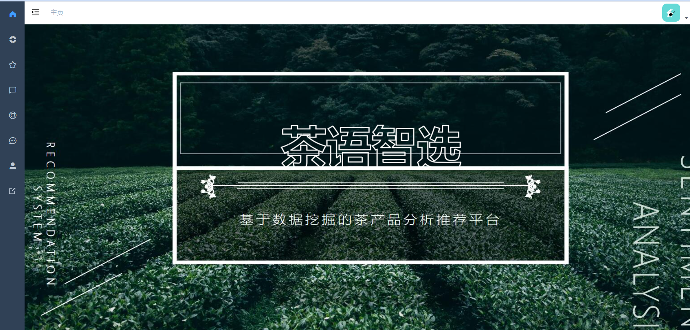

# 茶语

## Build Setup

```bash
# clone the project
git clone git@github.com:jieye12/tea.git

# enter the project directory
cd tea

# install dependency
npm install/pnpm install

# develop
npm run dev/pnpm dev
```

This will automatically open http://localhost:9528


## Demo



## Browsers support

Modern browsers and Internet Explorer 10+.

| [](http://godban.github.io/browsers-support-badges/)</br>IE / Edge | [](http://godban.github.io/browsers-support-badges/)</br>Firefox | [](http://godban.github.io/browsers-support-badges/)</br>Chrome | [](http://godban.github.io/browsers-support-badges/)</br>Safari |
| --------- | --------- | --------- | --------- |
| IE10, IE11, Edge| last 2 versions| last 2 versions| last 2 versions

## License

[MIT](https://github.com/PanJiaChen/vue-admin-template/blob/master/LICENSE) license.

Copyright (c) 2017-present PanJiaChen
